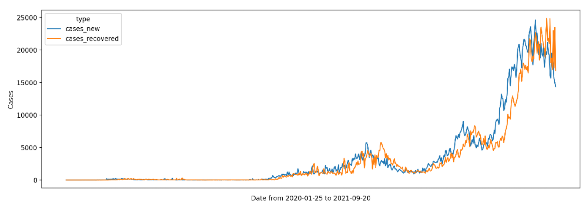
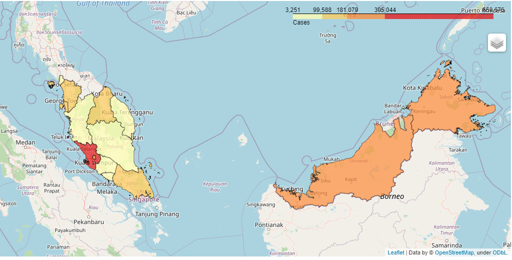
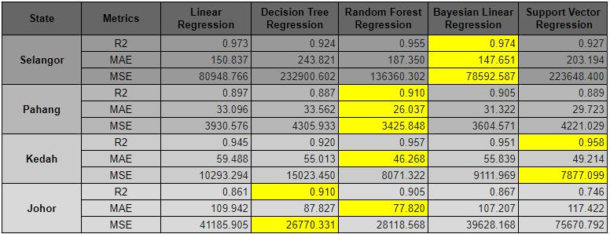
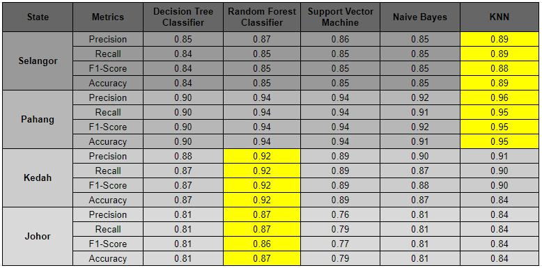

# COVID-19 Cases Aalysis
Analysis of COVID-19 Cases in Malaysia using data mining process.

The datasets used are taken from [MoH official github](https://github.com/MoH-Malaysia/covid19-public).

For more info, please refer to the documentation pdf file in the reference folder

# How to start the app ?
I have hosted the streamlit app on heroku, feel free to click this [link](https://bukancovidnow.herokuapp.com/) and try to explore.

To start jupyter file locally, navigate to Code folder and run the two jupyter file:
1. EDA and Correlation between states.ipynb
2. Feature Selection and Model Training.ipynb

To launch streamlit file locally, navigate to Code/Streamlit folder and type streamlit run DataMining.py on cmd/terminal

# Sample images of this program

Summary of regression model in predicting daily COVID cases

Summary of classification model in predicting daily COVID cases

